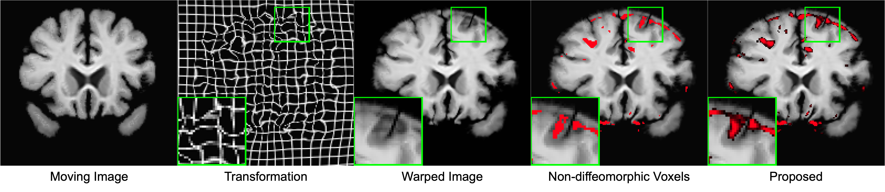
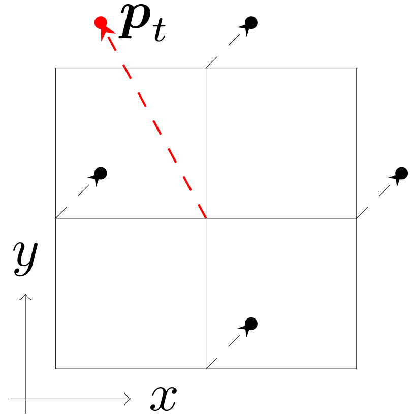

# digital diffeomorphism
This is an python implementation of the **digital diffeomorphism criteria** and
**non-diffeomorphic volume** computation we introduced in our paper:
    Liu, Yihao, et al. "On Finite Difference Jacobian Computation in Deformable
    Image Registration." arXiv preprint arXiv:2212.06060 (2022).

## Motivation
The Jacobian determinant $|J|$ of spatial transformations is a widely used metric in
deformable image registration, but the details of its computation are often overlooked.
Contrary to what one might expect, the commonly used central difference base $|J|$
does not reflect if the transformation is diffeomorphic or not. We proposed the
definition of digital diffeomorphism that solves several errors that inherent in
the central difference based $|J|$. We further propose to use non-diffeomorphic
volume to measure the irregularity of 3D transformations.

An example failure case for the central difference based $|J|$. The center pixel
has central difference based $|J|=1$ but it is not diffeomorphic. In fact, the
transformation at the center pixel has no effect on the computation of central
difference based $|J|$, even if it moves outside the field of view.
## Getting Started

### Installation
- Clone this repo:
```bash
git clone https://github.com/yihao6/digital_diffeomorphism.git
cd digital_diffeomorphism
```
- Install the dependencies:
```bash
pip install -r requirements.txt
```
- Download the [example data](https://iacl.ece.jhu.edu/index.php?title=Digital_diffeomorphism)
The example data contains displacement fields generated by [Im2grid](https://arxiv.org/pdf/2203.03626.pdf) algorithm for the task03 @ [MICCAI 2021 Learn2Reg challenge](https://learn2reg.grand-challenge.org/Learn2Reg2021/).
- Upzip the example data in the root directory

### Usage
```bash
python example.py --dataroot ./data/ --mask
```
This will calculate the mean, standard deviation, and the relative percentage of
1. average non-diffeomorphic voxels computed by the central difference;
2. average non-diffeomorphic tetrahedra; and
3. average non-diffeomorphic volume
for the 19 displacement fields in the example data.

### Citation
If you use this code, please cite our paper.
```
@article{liu2022on,
  title={On Finite Difference Jacobian Computation in Deformable Image Registration},
  author={Liu, Yihao and Chen, Junyu and Wei, Shuwen and Carass, Aaron and Prince, Jerry},
  journal={arXiv preprint arXiv:2212.06060},
  year={2022}
}

```
