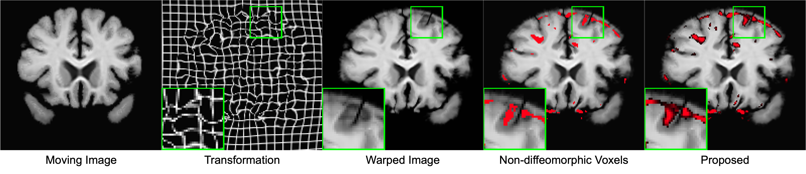
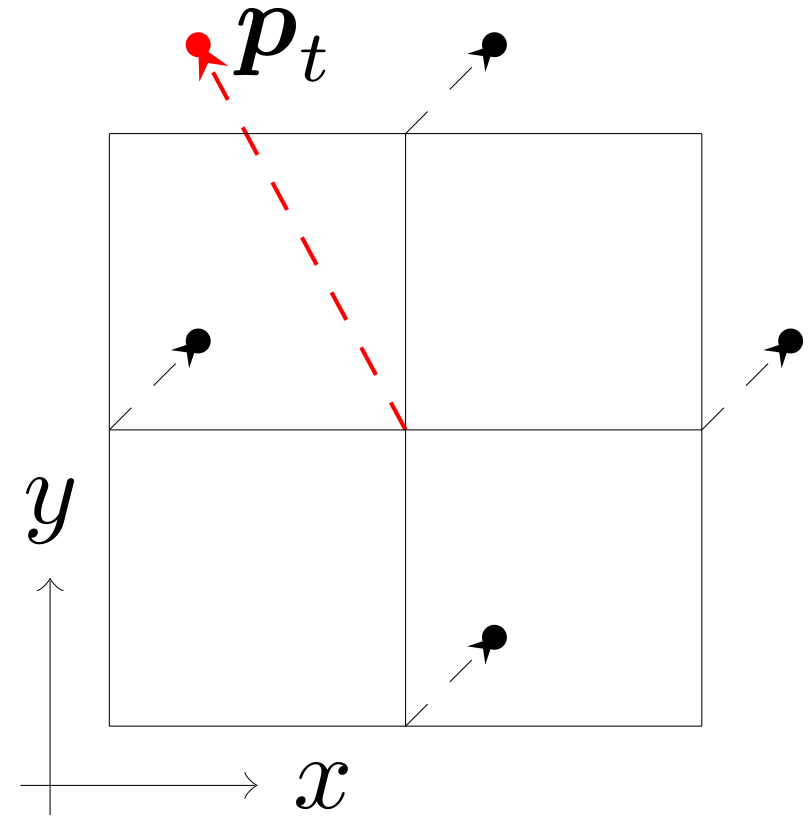
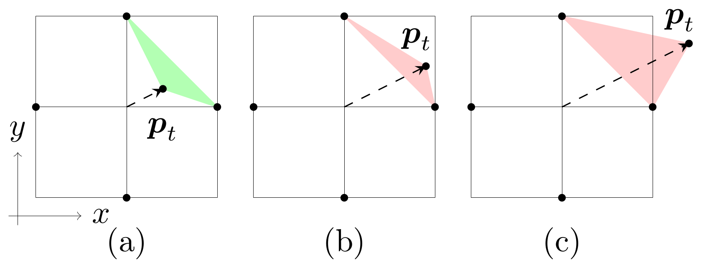

# Digital Diffeomorphism: Non-diffeomorphic volume and Non-diffeomorphic area
This is an implementation of the **non-diffeomorphic volume** and
**non-diffeomorphic area** computation we introduced in our paper:

<a href="https://doi.org/10.1007/s11263-024-02047-1">"On Finite Difference Jacobian Computation in Deformable Image Registration." Liu, Yihao, Chen, Junyu, Wei, Shuwen, Carass, Aaron, and Prince, Jerry. The International Journal of Computer Vision (2024).</a>

## Motivation
The Jacobian determinant $|J|$ of spatial transformations is a widely used measure in
deformable image registration, but the details of its computation are often overlooked.
Contrary to what one might expect, when approximated using the central difference,
the number of pixels/voxels with negative $|J|$ does not reflect if the transformation is diffeomorphic or not.
<p align="center">
  
</p>

The example above demonstrate a failure case of the central difference based $|J|$.
The center pixel has central difference based $|J|=1$ but it is not diffeomorphic.
In fact, the transformation at the center pixel has no effect on the computation of central
difference based $|J|$, even if it moves outside the field of view.

We proposed the definition of digital diffeomorphism that solves several errors that inherent in
the central difference based $|J|$. We further propose to use non-diffeomorphic
volume (NDV) and non-diffeomorphic area (NDA) to measure the irregularity of 3D/2D transformations.
The proposed NDV and NDA also measures the **severity** of the irregularity whereas the central difference approximated $|J|$
is only a binary indicator.
<p align="center">
  
</p>

The center pixel in all three cases shown above would be considered diffeomorphic
because of the checkerboard problem. The forward difference based $|J|$ is able to identiy that
(b) and (c) exhibit folding, but only NDA can provide the observation that the non-diffeomorphic space
caused by the transformation shown in (c) is larger than (b).
The transformation shown in (b) is obviously more favorable than the one shown in (c)
in terms of regularity. As such it is important for us to be able to draw distinctions between
there two senarios.

## Getting Started

### Installation
The easiest way to install the package is through the following command:
```
pip install digital-diffeomorphism
```

To install from the source:
```bash
git clone https://github.com/yihao6/digital_diffeomorphism.git

cd digital_diffeomorphism

python setup.py install
```

### Usage
To evaluate a 3D sampling grid with dimension $H\times W\times D\times 3$
```bash
ndv grid_3d.nii.gz
```
This will calculate
1. non-diffeomorphic volume; and
2. non-diffeomorphic voxels computed by the central difference.

If the transformation is stored as a displacement field:
```bash
ndv disp_3d.nii.gz --disp
```

Use '--gpu' option to enable GPU acceleration:
```bash
ndv grid_3d.nii.gz --gpu
# or
ndv disp_3d.nii.gz --disp --gpu
```

To evaluate a 2D sampling grid with dimension $H\times W\times 2$
```bash
nda grid_2d.nii.gz
```
This will calculate
1. non-diffeomorphic area; and
2. non-diffeomorphic pixels computed by the central difference.

If the transformation is stored as a displacement field:
```bash
ndv disp_2d.nii.gz --disp
```

Example inputs can be found at https://iacl.ece.jhu.edu/index.php?title=Digital_diffeomorphism

### Potential Pitfalls
1. Several packages implement spatial transformations using a normalized sampling grid.
For example, <a href="https://arxiv.org/abs/2212.06060">torch.nn.functional.grid_sample</a>.
In this package, we use un-normalized coordinates to represent transformations.
Therefore, the input sampling grid or displacement field should be in voxel or pixel units.
In case the input is normalized, it must be unnormalized prior to using this package.

### Citation
If you use this code, please cite our paper.
```
@article{liu2024finite,
  title={On finite difference jacobian computation in deformable image registration},
  author={Liu, Yihao and Chen, Junyu and Wei, Shuwen and Carass, Aaron and Prince, Jerry},
  journal={International Journal of Computer Vision},
  pages={1--11},
  year={2024},
  publisher={Springer}
}

```
